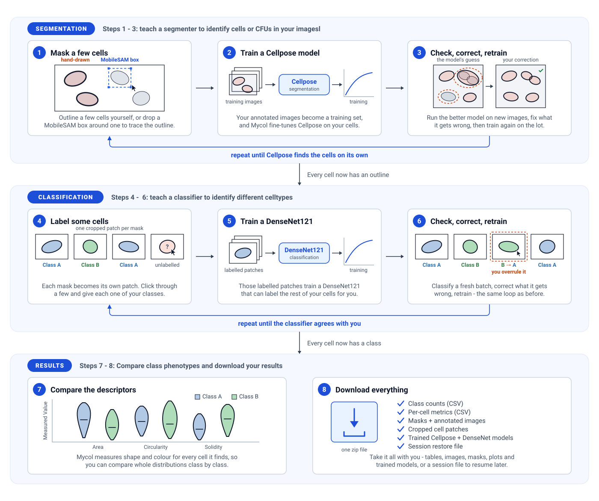
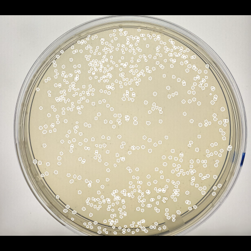
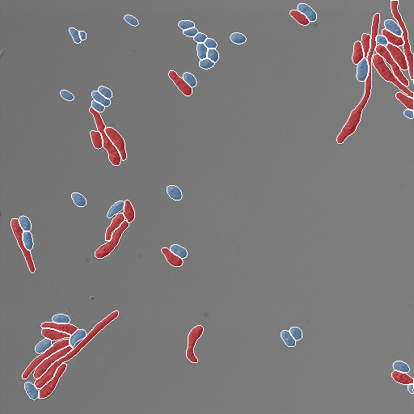
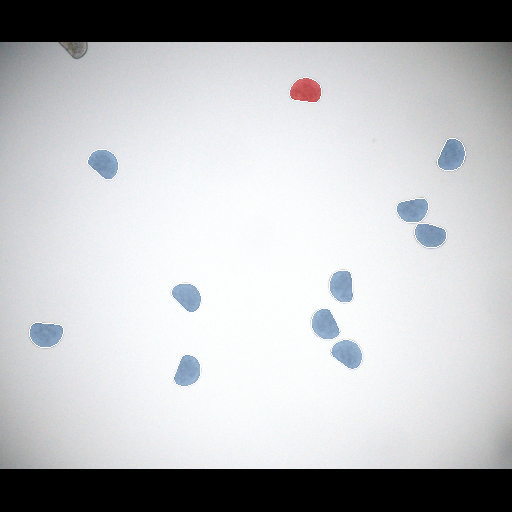

<div align="center">

# Mycol

_A lightweight, human-in-the-loop microscopy image analysis app._

**[Homepage](https://biosustain.github.io/mycol/)** &nbsp;&middot;&nbsp; [FAQ](https://biosustain.github.io/mycol/faq.html) &nbsp;&middot;&nbsp; [Functionality Guide](https://biosustain.github.io/mycol/functionality.html) &nbsp;&middot;&nbsp; [Preprint](https://www.biorxiv.org/content/10.64898/2026.06.02.729113v1)

### [⬇ Download Mycol](https://github.com/biosustain/mycol/releases/latest)

<sub>**Windows** and **macOS** &nbsp;&middot;&nbsp; no Python installation required &nbsp;&middot;&nbsp; [install options](#installation)</sub>

</div>

Mycol is a Streamlit-based application that makes machine-learning-assisted microscopy analysis accessible to non-specialists. It enables fast annotation, automated segmentation and classification, model fine-tuning, and quantitative phenotyping, all on a standard laptop and without coding.

<div align="center">

[**◆** Overview](#overview) &nbsp;&middot;&nbsp; [**1** Upload](#upload) &nbsp;&middot;&nbsp; [**2** Annotate](#annotate) &nbsp;&middot;&nbsp; [**3** Train](#train) &nbsp;&middot;&nbsp; [**4** Visualize](#visualize) &nbsp;&middot;&nbsp; [**5** Downloads](#downloads) &nbsp;&middot;&nbsp; [Get Mycol](#installation)

</div>

---

<a id="overview"></a>

<sub>◆ &nbsp;&nbsp; THE MYCOL WORKFLOW</sub>

## How It Works

> Mycol guides you through a clear, step-by-step pipeline - from raw microscopy images to trained AI models and quantitative cell-level insights.

Each stage builds on the last, but you can enter or exit at any point depending on what you already have.

Start by **uploading** your images and any existing masks or models. Move to the **annotation** page to segment cells automatically with Cellpose or MobileSAM, correct any errors interactively, and classify cells manually or with a DenseNet model. If you want better automated results, use the **training** page to fine-tune a Cellpose or DenseNet model on your own annotated data - newly trained models feed directly back into annotation. Finally, the **analysis** page lets you visualize and export cell population statistics across classes and experiments. At any point you can **download** your annotated data, trained models, or a full session restore file for reuse and publication.

<p align="center">
  
</p>

---

<a id="upload"></a>

<sub>STEP 1 &nbsp;&middot;&nbsp; UPLOAD MODELS AND DATA</sub>

## Upload Your Data

> This is where your analysis begins.

Upload the key files Mycol will use in later steps:

- **Images** _(required)_ - the microscopy or sample images you want to analyze.
- **Masks** _(optional)_ - segmentation masks that outline cells or regions of interest.
- **Cellpose model** _(optional)_ - a trained model for automatic cell segmentation. [Learn about Cellpose →](https://www.nature.com/articles/s41592-022-01663-4)
- **DenseNet model** _(optional)_ - a classification model for labeling segmented cells. [Learn about DenseNet →](https://openaccess.thecvf.com/content_cvpr_2017/papers/Huang_Densely_Connected_Convolutional_CVPR_2017_paper.pdf)

Once uploaded, a **summary table** shows which images have masks linked, how many cells are highlighted in each image, and any models you've provided.

<table>
<tr>
<td width="38%" valign="middle">

**Upload** models, images, masks, or saved sessions - just drag and drop.

</td>
<td width="62%">

</td>
</tr>
</table>

---

<a id="annotate"></a>

<sub>STEP 2 &nbsp;&middot;&nbsp; ANNOTATE IMAGES</sub>

## Segment and Classify Your Cells

> The central workspace where annotated datasets are produced.

Here you can:

- **View images** overlaid with their associated cell masks.
- **Generate new masks** automatically with [Cellpose](https://www.nature.com/articles/s41592-022-01663-4) or [MobileSAM](https://github.com/ChaoningZhang/MobileSAM).
- **Manually edit or correct masks** - add, remove, or adjust individual cells.
- **Classify cells** using an uploaded DenseNet model for automated classification, or by clicking directly on cells in the image for manual labeling.

Once ready, download your dataset (including images, masks and tabulated cell counts) or move on to phenotypic comparison or training new models.

<table>
<tr>
<td width="38%" valign="middle">

**Navigate** images overlaid with their masks and change display options on the fly.

</td>
<td width="62%">

</td>
</tr>
<tr>
<td width="38%" valign="middle">

**Add and remove** masks and assign classes directly on interactive images.

</td>
<td width="62%">

</td>
</tr>
<tr>
<td width="38%" valign="middle">

**Generate** accurate cell masks using Cellpose and MobileSAM models.

</td>
<td width="62%">

</td>
</tr>
</table>

---

<a id="train"></a>

<sub>STEP 3 &nbsp;&middot;&nbsp; TRAIN MODELS</sub>

## Train Your Own Analysis Models

> Use the datasets you've created to fine-tune your own models.

Choose from:

- **Cellpose segmentation model** - improve or customize how cells are automatically detected and outlined.
- **DenseNet classification model** - fine-tune how cells are categorized based on their features.

Sensible default parameters are provided, but you can also run **hyperparameter optimization** to explore how different settings affect model performance.

After training, performance plots show training progress, accuracy, loss, and validation metrics. Trained models can be **used immediately** in the annotation page or **downloaded** for reuse.

<table>
<tr>
<td width="38%" valign="middle">

**Fine-tune** Cellpose models to your dataset with a single click.

</td>
<td width="62%">

</td>
</tr>
<tr>
<td width="38%" valign="middle">

**Monitor** training progress in real time.

</td>
<td width="62%">

</td>
</tr>
<tr>
<td width="38%" valign="middle">

**Assess** fine-tuning results through automatically generated diagnostic plots.

</td>
<td width="62%">

</td>
</tr>
</table>

---

<a id="visualize"></a>

<sub>STEP 4 &nbsp;&middot;&nbsp; COMPARE PHENOTYPES</sub>

## Get to Know Your Data

> Explore and summarize the quantitative results of your analyses.

Create and download plots of **cell population statistics** - such as cell area, perimeter, and other morphological features - grouped by **cell class**.

Select which classes and characteristics to include, and Mycol generates plots that help you:

- Compare cell features across classes or conditions.
- Identify trends in cell populations across multiple images or experiments.
- Quantify variability and relationships among measured features.

Downloadable results include **cell counts per class**, **descriptive statistics**, and **publication-ready plots**.

<table>
<tr>
<td width="38%" valign="middle">

**Visualize and compare** the morphologies of identified cell populations through interactive graphs.

</td>
<td width="62%">

</td>
</tr>
</table>

---

<a id="downloads"></a>

<sub>DOWNLOADS</sub>

## Export Your Results

> The Downloads page lets you package and export everything produced during your session.

Choose exactly what to include before preparing the zip:

- **Images & Masks** - export your images with colored mask overlays, optional per-image class count labels, intensity-normalized images, and cropped **cell patch images** for every individual segmented cell.
- **Tables** - CSV files with per-image cell counts and full **cell metrics** (area, circularity, elongation, and more) for every cell.
- **Trained Models** - fine-tuned Cellpose or DenseNet weights together with the training dataset, loss curves, and evaluation metrics.
- **Session Restore** - save a zip you can re-upload to pick up exactly where you left off in a future session.

Click **Prepare Download** to build the zip, then **Download Files** to save it locally.

<p align="center">
  
</p>

---

<a id="features"></a>

## Features

#### Annotation & QC

- Upload images and optional masks
- Manual mask drawing and editing
- MobileSAM-guided segmentation
- Automated Cellpose segmentation (single or batch mode)
- Interactive classification (manual or DenseNet-based)

#### Model Fine-Tuning

- Train Cellpose (segmentation) and DenseNet (classification) models directly in the app
- Default training settings for general use
- Diagnostic outputs:
  - Loss curves
  - IoU scores
  - True vs. predicted counts
  - Accuracy, precision, F1, confusion matrix
- Download trained models and training summaries

#### Cell Metrics & Phenotyping

- Automatic computation of cell descriptors (size, shape, elongation, compactness, etc.)
- Visual comparison of phenotypic classes
- Export plots and tabulated descriptors
- Built-in explanations for descriptor interpretation

#### Lightweight & Accessible

- Runs locally on standard hardware
- Minimal dependencies
- Designed for small-scale workflows

---

<a id="installation"></a>

## Download for Windows

> **No Python, pip, uv or git required.** The download contains everything the app needs, including the Cellpose and MobileSAM model weights.

**1.** Download **[mycol-windows-cpu.zip](https://github.com/biosustain/mycol/releases/latest)** from the latest release.

**2.** Right-click the zip and choose **Extract All**. Keep the folder together — `mycol.exe` expects `bin\` and `src\` beside it.

**3.** Double-click **`mycol.exe`**.

> [!NOTE]
> Windows will warn that it *"protected your PC"*, because the download is not code-signed. Click **More info**, then **Run anyway**. This is expected.

<details>
<summary><b>Which build should I pick?</b></summary>

<br>

| Build | Pick it when | Size |
| --- | --- | --- |
| **`mycol-windows-cpu.zip`** | Almost always. Works on any 64-bit Windows machine. | ~1 GB |
| `mycol-windows-cuda.zip` | Only if the machine has an **NVIDIA** GPU and a driver supporting CUDA 12.6. Speeds up segmentation and training. | ~3 GB |

Integrated Intel or AMD graphics are *not* NVIDIA GPUs — use the CPU build.

</details>

<details>
<summary><b>The app didn't start</b></summary>

<br>

Run **`mycol_debug.exe`** instead: it is the same program with a console window, so startup errors stay on screen. A log of the last run is also written to:

```
%LOCALAPPDATA%\Mycol\mycol.log
```

Please include that log when [opening an issue](https://github.com/biosustain/mycol/issues).

</details>

---

## Download for macOS

> **No Python, uv or git required.** The app contains everything it needs, including the Cellpose and MobileSAM model weights, and uses your Mac's GPU through Metal.

**1.** Download the disk image for your Mac from the [latest release](https://github.com/biosustain/mycol/releases/latest):

| Your Mac | File |
| --- | --- |
| Apple Silicon (M1 and later) | `mycol-macos-arm64.dmg` |
| Intel | `mycol-macos-x86_64.dmg` |

Not sure? Click  > **About This Mac**. "Chip" means Apple Silicon; "Processor" means Intel.

**2.** Open the `.dmg` and drag **Mycol** into **Applications**.

**3.** Open Mycol from Applications.

> [!NOTE]
> macOS may say Mycol *"cannot be opened because it is from an unidentified developer"*. Open **System Settings → Privacy & Security**, scroll down, and click **Open Anyway** next to the Mycol message. You only do this once.

<details>
<summary><b>The app didn't start</b></summary>

<br>

A log of the last run is written to:

```
~/Library/Logs/Mycol/mycol.log
```

Open it with Console.app, or run `open ~/Library/Logs/Mycol/mycol.log`. Please include it when [opening an issue](https://github.com/biosustain/mycol/issues).

</details>

---

## For Developers

> [!NOTE]
> This project uses [`uv`](https://docs.astral.sh/uv/) as its package manager. It handles the virtual environment and dependencies for you. Install it with the [official instructions](https://docs.astral.sh/uv/getting-started/installation/) — note that `pip install uv` only works if you already have Python.

**1. Clone the repository**

```bash
git clone https://github.com/biosustain/mycol.git
```

**2. Navigate into the repository in your terminal**

```bash
cd mycol
```

**3. Install dependencies**

This automatically creates a virtual environment and installs everything the app needs.

```bash
uv sync
```

### Run the app

From inside the repository, run:

```bash
uv run streamlit run app.py
```

`uv run` executes the command inside the project's virtual environment. Alternatively, activate the environment first (`source .venv/bin/activate` on macOS/Linux or `.venv\Scripts\activate` on Windows) and then run `streamlit run app.py`.

### GPU support

`uv sync` installs the **CPU** build of PyTorch on Windows and Linux, because the CUDA build pulls in roughly 2.5 GB of NVIDIA runtime packages that most machines cannot use. macOS uses the standard PyPI build, which already supports MPS.

To opt into CUDA on a machine with an NVIDIA GPU:

```bash
uv pip install torch torchvision --index-url https://download.pytorch.org/whl/cu126
```

### Building the Windows bundle

See [docs/BUILDING.md](docs/BUILDING.md).

---

## Example Use Cases

- Rapid cell counting
- Creating curated datasets of annotated images
- Automating image annotation (with human QC)
- Morphology-based phenotypic comparison

Each example below was segmented in Mycol and exported with its mask overlay. Where the study defines classes, cells are coloured by class; where it does not, masks take the unlabelled colour.

<table>
<tr>
<td width="38%" valign="middle">

**Colony (CFU) counting**

Colonies on an agar plate, segmented into 734 individual masks. No classes are defined for this study, so the masks are drawn in the unlabelled colour.

</td>
<td width="62%">

</td>
</tr>
<tr>
<td width="38%" valign="middle">

**Spore germination**

Segmented cells classified as **Germinated** (red) or **Ungerminated** (blue). This frame carries 27 and 35 of each.

</td>
<td width="62%">

</td>
</tr>
<tr>
<td width="38%" valign="middle">

**Larval morphology**

Larvae segmented and classified as **normal** (blue) or **abnormal** (red), so shape descriptors can be compared between the two groups.

</td>
<td width="62%">

</td>
</tr>
</table>

---

## License

MIT
